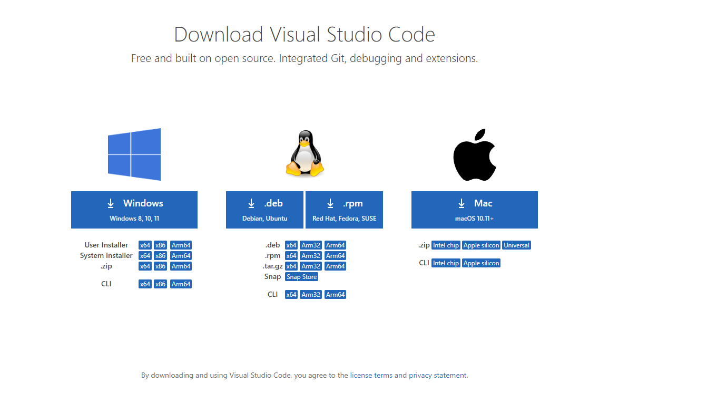
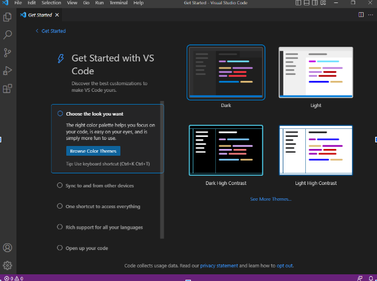
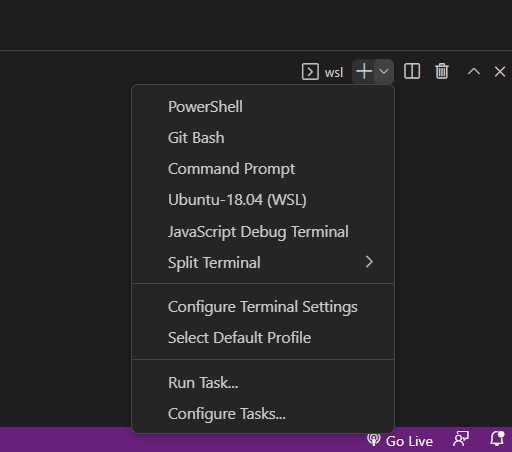
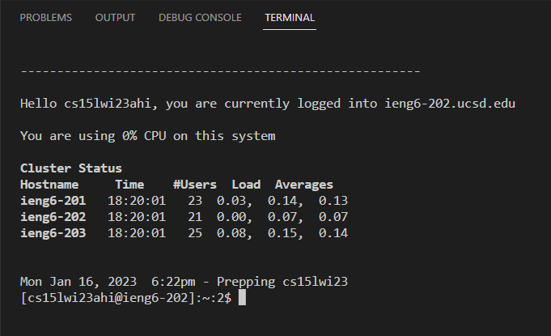
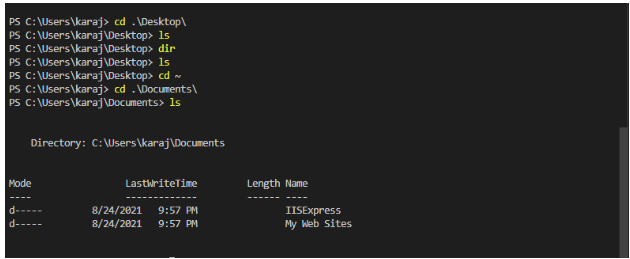

# Lab Report 1

## Kavin Raj CSE15L

Today we will be going through how to set up the enviornment we will be using for CSE15L!

Learning objectives:

1. Installing VScode
2. Remotely Connecting to ieng6
3. Trying Some Various Functions

- **We will first start by installing VScode**

We will want to install VScode using this [link.](https://code.visualstudio.com/download)

Choose the download that works for the device you are using and wait for it to download. 

Once done open the download file and run the installation process, and once it is installed open up and run VSCode. You should get a screen looking like this:

Congrats we have now installed VScode!

- **The next step would be to connect to the class' remote server**

For this step we would need to install git if we are using windows. We can install that using this [link](https://gitforwindows.org/)

Once installed we finally have git running in our device. On the VScode terminal, we would want to click on the dropdown button next to the plus sign on the right side of the terminal and then click on git bash.

From here, with using the ssh command we could set a secure connection to the ieng6 server.

To do that we need to use 
`$ ssh cs15lwi23zz@ieng6.ucsd.edu`, where the 2 zs are replaced with our own unique letters from our course-specific-account.

Once you enter the command you will be asked if you are sure to connect. Just type "yes" to continue

Afterwards you will also be asked to add your password, go ahead and type in the password you set for your account and you should be connected to the remote server

Once connected you will see something like this 

Congrats we are now in our class's remote server!

- **Let's now play around in the terminal and get used to some of the commands we can use**

Here are some commands we could try: `cd`, `ls`, `pwd`, `mkdir`, and `cp`

These commmands allowed me to traverse around the various directories of my computer and visuaize where I am as well. The PWD command allows you to know your directory address and the mkdir command allows you to make new directories. You are also able to copy files bu using the cp command. An interesting thing I found out about running these commands is that it is very easy to go through and open a directory of your choice and input commands such as compiling or running a program within these directories.

Play around and get comfortable with the terminal and the enviornment we will be using for this class.
