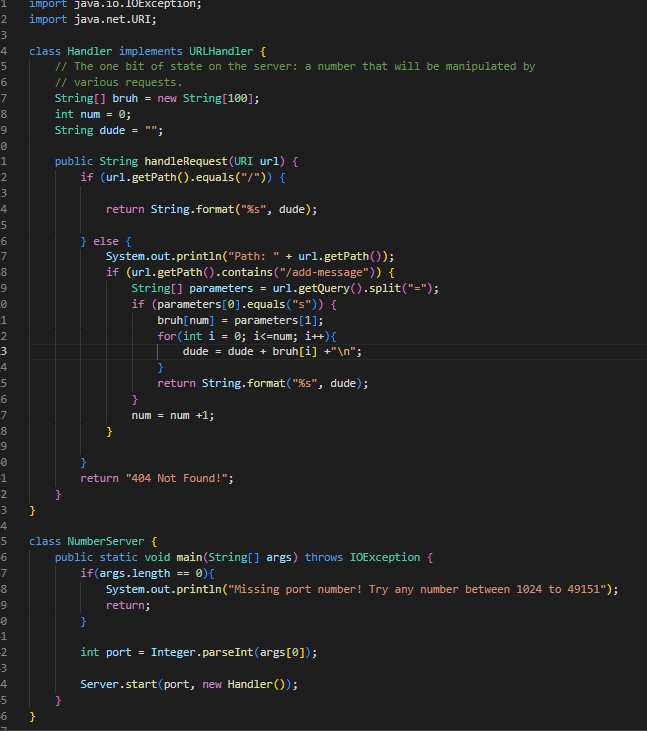

# Lab Report 2

## Kavin Raj CSE15L

### Part 1 ###


- Picture of the code
- The methods used in the code include `handleRequest`, which focuses on adding messages to the webpage. Within this method we call methods from the class `URLHandler`, which include: `getPath` and `getQuery`.
- `handleRequest` requires a URI input. The rest of the values are largerly depedent on the input or how many is needed to be added. `num` for example starts at 0 and slowly increments by one as more messages are added. All the messages are put into a string array. They are then put into another array which would be return to the webpage.
- When the request is made, values for num goes up by one and the new string being inputed is added to a new element of the string array and also added to the string named `dude`.


- Picture of the web server's output.

### Part 2 ###

We will be looking at the bug in the method reverseInPlace in the program ArrayExamples
-We received a failure-inducing input when we did this test:
```@Test  
  public void testReverseInPlace2() { 
   int[] input1 = { 3,4,6};   
    ArrayExamples.reverseInPlace(input1); 
    assertArrayEquals(new int[]{ 6,4,3 }, input1);	
  }
  ```

An input that doesn't induce failure would be:

```@Test 
	public void testReverseInPlace1() {
    int[] input1 = { 5 };
    ArrayExamples.reverseInPlace(input1);
    assertArrayEquals(new int[]{ 5 }, input1);
	}
  ```
  
  
 
 Above is the output given when running those two test. It mentions a third test but we got the result expected: one working test and one failed test
 
 Here is the orginal code of the method:

``` 
static void reverseInPlace(int[] arr) {
    for(int i = 0; i < arr.length; i += 1) {
      arr[i] = arr[arr.length - i - 1];
    }
  }
  ```
The issue was that it would replace the first element but forget to copy that element to add it to it's respective opposite element


``` 
static void reverseInPlace(int[] arr) {
    int temp;
    for(int i = 0; i < arr.length/2; i += 1) {
      temp = arr[i];
      arr[i] = arr[arr.length - i - 1];
      arr[arr.length - i - 1] = temp;
    }
  }
  ```


Here is how it would look once fixed
The fix worked becuase it would save elements whose numbers were going to be replaced into a temp variable and then using that temp to add it to the other end of the array.

### Part 3

A few things I learned in the last two weeks is inputting values through a url and also setting up tests for your code. When setting up the web server it was quite interesting to see that you could add values to variables in the url bar. It gives more insight of a url for various websites I use. Also learning how to test various methods is going to be very useful in future projects for debugging.
 
